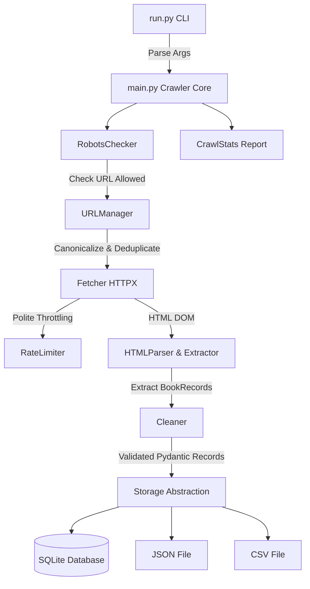

# Polite Scraper 🕷️⚡

A modular, production-grade Python web crawler designed with **polite crawling standards**, structured data extraction, multi-backend persistence, unit testing, containerization, and REST API readiness.

---

## 🌟 Features

- 🤖 **Polite Crawling Engine**: Respects `robots.txt` directives via `urllib.robotparser` and enforces configurable request throttling.
- 🔗 **Canonical URL Manager**: Handles URL normalization (casing, parameter sorting, fragment removal) and in-memory visited URL deduplication.
- 📊 **Crawl Statistics & Metrics**: Real-time metrics collection tracking duration, throughput, success rate, and average response latency.
- 💾 **Abstracted Storage Backends**: Clean `Storage` base contract supporting **SQLite** (with `UNIQUE` duplicate filtering), **JSON**, and **CSV** exports.
- 🖥️ **CLI Command Interface**: Full command-line flexibility powered by `argparse` (`--limit`, `--delay`, `--json`, `--csv`, `--sqlite`, `--verbose`).
- 🔄 **Rotating Logging System**: Dual rotating file logs (`logs/scraper.log` and `logs/error.log`) with configurable log levels.
- 🧪 **Comprehensive Pytest Suite**: 100% test pass rate across parser, cleaner, storage, URL manager, and stats collector modules.
- 🐳 **Docker & Compose Ready**: Multi-stage lightweight `Dockerfile` and volume-mounted `docker-compose.yml`.

---

## 🏗️ Architecture Overview



---

## 📁 Directory Structure

```text
polite_scraper/
├── app/
│   ├── main.py            # Main crawler orchestration loop
│   ├── config.py          # Environment settings loader
│   ├── crawler/
│   │   ├── fetcher.py     # HTTPX download client with retries
│   │   ├── limiter.py     # Rate limiting delay handler
│   │   ├── robots.py      # Robots.txt permission validator
│   │   ├── scheduler.py   # Next-page pagination finder
│   │   └── url_manager.py # Canonical URL normalization & visited tracking
│   ├── models/
│   │   └── record.py      # Pydantic data schema for BookRecord
│   ├── parser/
│   │   ├── html_parser.py # BeautifulSoup parse engine
│   │   ├── extractor.py   # DOM element extraction
│   │   └── cleaner.py     # Price, rating, and string normalization
│   ├── storage/
│   │   ├── base.py        # Abstract Storage base class contract
│   │   ├── sqlite_storage.py # SQLite DB persistence with duplicate filtering
│   │   ├── json_storage.py   # JSON file exporter
│   │   └── csv_storage.py    # CSV file exporter
│   └── utils/
│       ├── logger.py      # Rotating file logging setup
│       └── stats.py       # Crawl metrics & report generator
├── tests/                 # Pytest unit test suite
├── Dockerfile             # Container build definition
├── docker-compose.yml     # Docker compose service orchestrator
├── run.py                 # CLI execution entrypoint
├── requirements.txt       # Project dependencies
└── README.md              # Documentation
```

---

## 🚀 Quickstart Guide

### 1. Installation

Clone the repository and install dependencies:

```bash
python -m venv .venv
source .venv/bin/activate  # On Windows: .venv\Scripts\activate
pip install -r requirements.txt
```

### 2. Environment Setup

Create a `.env` file in the root directory:

```env
APP_NAME=Polite Scraper
BASE_URL=https://books.toscrape.com
USER_AGENT=PoliteScraper/1.0 (+https://github.com/abhi)
REQUEST_TIMEOUT=30
REQUEST_DELAY=2
OUTPUT_JSON=app/output/data.json
OUTPUT_CSV=app/output/data.csv
DATABASE_PATH=app/output/scraper.db
LOG_LEVEL=INFO
```

---

## 💻 CLI Usage Examples

Run the crawler with custom flags:

```bash
# Crawl first 5 pages and export to SQLite, JSON, and CSV with debug output
python run.py --limit 5 --json --csv --sqlite --verbose

# Custom request delay override (3 seconds per request)
python run.py --limit 3 --delay 3.0 --json

# Default execution (SQLite + JSON export)
python run.py
```

### Sample Output Summary

```text
==========================================
           Crawl Report
==========================================
Pages Crawled      : 5
Books Extracted    : 100
Failed Requests    : 0
Success Rate       : 100.0%
Avg Response Time  : 1.42 sec
Total Duration     : 14.8 sec
==========================================
```

---

## 🐳 Docker Deployment

Run the crawler inside a containerized environment using Docker Compose:

```bash
# Build and run container
docker compose up --build
```

Target output files (`scraper.db`, `data.json`, `data.csv`) will be persisted in `./app/output/`.

---

## 🧪 Testing & Code Quality

Execute the test suite using `pytest`:

```bash
# Run unit test suite
pytest tests/

# Run code style formatting check
black --check .
ruff check .
```

---

## 🛣️ Production Roadmap

- [x] **Sprint 11–14**: Production Crawler Core (URL Manager, Stats, Storage Interface, CLI)
- [x] **Sprint 15–19**: Engineering Standards (Pytest Suite, Docker, Rotating Logs, Documentation)
- [ ] **Sprint 20–24**: Scalability & REST API (Async `httpx.AsyncClient` Engine, PostgreSQL Storage, FastAPI Service, Performance Benchmarking)
