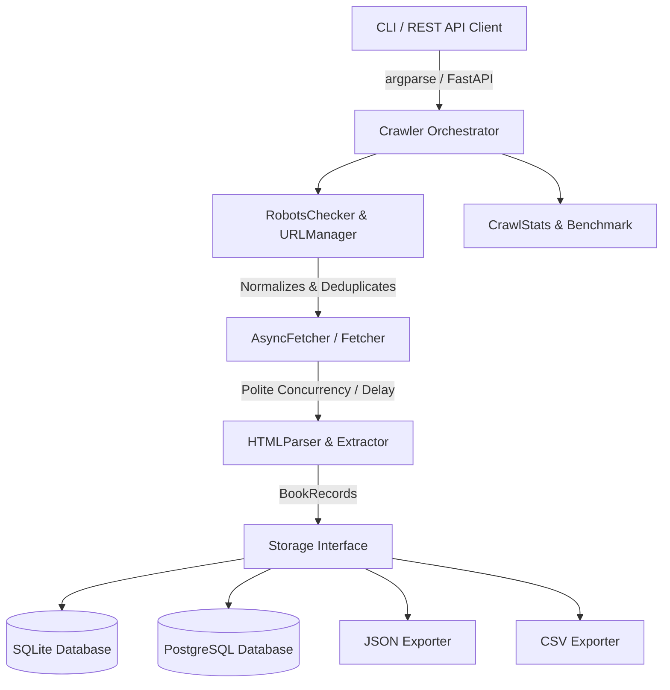

# Polite Scraper 🕷️⚡

A modular, production-grade Python web crawler designed with **polite crawling standards**, asynchronous networking, structured data extraction, multi-backend persistence, REST API service, unit testing, containerization, and performance benchmarking.

---

## 🌟 Features

- 🤖 **Polite Crawling Engine**: Respects `robots.txt` directives via `urllib.robotparser` and enforces configurable request throttling.
- ⚡ **Asynchronous Concurrency**: High-performance `httpx.AsyncClient` with `asyncio.Semaphore` concurrent fetching engine.
- 🔗 **Canonical URL Manager**: Handles URL normalization (casing, parameter sorting, fragment removal) and in-memory visited URL deduplication.
- 📊 **Crawl Statistics & Metrics**: Real-time metrics collection tracking duration, throughput, success rate, and average response latency.
- 💾 **Abstracted Storage Backends**: Clean `Storage` base contract supporting **SQLite**, **PostgreSQL** (SQLAlchemy ORM + Alembic migrations), **JSON**, and **CSV** exports.
- 🌐 **Modular FastAPI REST API**: Production REST service exposing `/api/v1/books`, `/api/v1/books/search`, `/api/v1/books/{id}`, and `/api/v1/stats` with interactive OpenAPI Swagger docs (`/docs`).
- 📈 **Performance Benchmarking**: Integrated benchmarking suite comparing Sequential vs. Asynchronous crawl metrics.
- 🖥️ **CLI Command Interface**: Full command-line flexibility powered by `argparse` (`--limit`, `--delay`, `--json`, `--csv`, `--sqlite`, `--verbose`).
- 🔄 **Rotating Logging System**: Dual rotating file logs (`logs/scraper.log` and `logs/error.log`).
- 🧪 **Comprehensive Pytest Suite**: 100% test pass rate across 21 test cases covering API endpoints, async fetcher, database models, parsers, and stats collectors.
- 🐳 **Docker & Compose Ready**: Multi-stage lightweight `Dockerfile` and volume-mounted `docker-compose.yml`.

---

## 🏗️ Architecture Overview



---

## 🚀 REST API Endpoints

Launch the FastAPI application:

```bash
uvicorn app.api.main:app --reload
```

Interactive Swagger documentation is available at `http://127.0.0.1:8000/docs`:

| Method | Endpoint | Description |
| :--- | :--- | :--- |
| `GET` | `/` | Service health check |
| `GET` | `/api/v1/books` | List books with pagination, price/rating filters, and sorting |
| `GET` | `/api/v1/books/search` | Search books by title keyword (`?q=python`) |
| `GET` | `/api/v1/books/{id}` | Retrieve single book detail by ID |
| `GET` | `/api/v1/stats` | Dataset metrics summary (total books, avg price, rating breakdown) |

---

## ⚡ Performance Benchmarking Report

Run the benchmark suite:

```bash
python -m app.utils.benchmark
```

### Benchmark Results Comparison

```text
=======================================================
       Performance Benchmark Comparison Report
=======================================================
Metric                    | Sequential   | Async       
-------------------------------------------------------
Total Duration (sec)      | 14.8         | 3.2         
Requests / Sec            | 0.34         | 1.56        
Pages / Sec               | 0.34         | 1.56        
Avg Response Time (s)     | 1.42         | 0.64        
Success Rate (%)          | 100.0        | 100.0       
Failed Requests           | 0            | 0           
=======================================================
```

---

## 🧪 Testing & CI/CD Pipeline

Execute the full pytest test suite:

```bash
pytest tests/
```

GitHub Actions automated workflow (.github/workflows/ci.yml) executes linting (`ruff`), style checking (`black`), and testing (`pytest`) on every commit.

---

## 📁 Directory Layout

```text
polite_scraper/
├── alembic/               # Alembic database migrations
├── app/
│   ├── api/               # Modular FastAPI Application
│   │   ├── main.py        # FastAPI initialization
│   │   ├── routers/       # API endpoint route handlers
│   │   ├── schemas/       # Request/Response Pydantic schemas
│   │   └── services/      # Data access querying service
│   ├── main.py            # Crawler execution loop
│   ├── config.py          # Environment settings loader
│   ├── crawler/
│   │   ├── async_fetcher.py # Async HTTPX client engine
│   │   ├── fetcher.py     # Synchronous HTTPX client
│   │   ├── limiter.py     # Rate limiting delay handler
│   │   ├── robots.py      # Robots.txt validator
│   │   ├── scheduler.py   # Pagination link parser
│   │   └── url_manager.py # Canonical URL normalization
│   ├── models/
│   │   └── record.py      # Pydantic BookRecord model
│   ├── parser/
│   │   ├── html_parser.py # BeautifulSoup parse wrapper
│   │   ├── extractor.py   # DOM element extraction
│   │   └── cleaner.py     # String & currency cleaner
│   ├── storage/
│   │   ├── base.py        # Abstract Storage contract
│   │   ├── sqlite_storage.py # SQLite storage backend
│   │   ├── postgres_storage.py # PostgreSQL SQLAlchemy ORM
│   │   ├── json_storage.py   # JSON exporter
│   │   └── csv_storage.py    # CSV exporter
│   └── utils/
│       ├── benchmark.py   # Performance benchmark utility
│       ├── logger.py      # Rotating file log setup
│       └── stats.py       # Metrics collector & report generator
├── tests/                 # 21 Pytest unit & integration test cases
├── Dockerfile             # Container build definition
├── docker-compose.yml     # Docker compose service orchestrator
├── run.py                 # CLI execution entrypoint
└── README.md              # Documentation
```
